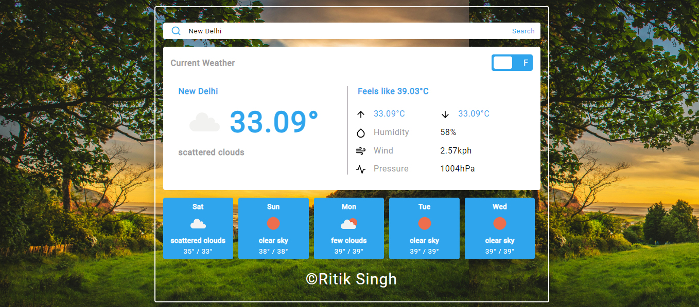

# Weather Forecast App

A React-based Weather Forecast App that allows users to view the current weather and a 5-day forecast for any city. The app also includes features like temperature unit conversion (Celsius/Fahrenheit) and a custom-built city search dropdown.

## Features

- **Current Weather Display**: Shows weather information like temperature, humidity, wind speed, and pressure for a default city (e.g., New Delhi).
- **City Search**: Allows users to search for any city using a custom dropdown search box, with real-time weather data fetched from OpenWeather API.
- **5-Day Forecast**: Displays a 5-day weather forecast with high/low temperatures, weather conditions, and an icon representing the forecast.
- **Temperature Unit Conversion**: Switch between Celsius and Fahrenheit with a simple toggle button.
- **Responsive Design**: Ensures the app looks great on all devices, from mobile to desktop## Screenshots




## Installation

To run this project locally, follow these steps:

### Prerequisites

Ensure you have the following installed:

- [Node.js](https://nodejs.org/) (version 12 or higher)
- npm (usually comes with Node.js)

### Steps

1. **Clone the repository**:

   ```bash
   git clone https://github.com/ritik7739/weather-forecast-app.git
   ```

2. **Navigate to the project directory**:

   ```bash
   cd weather-forecast-app
   ```

3. **Install dependencies**:

   Run the following command to install the required packages:

   ```bash
   npm install
   ```

4. **Set up the API Key**:

   You'll need an API key from [OpenWeatherMap](https://openweathermap.org/api). Once you have the key, create a `.env` file in the root of the project with the following content:

   ```bash
   appId=your_openweather_api_key
   ```

5. **Start the app**:

   Run the following command to start the development server:

   ```bash
   npm start
   ```

6. **Open the app in the browser**:

   Once the server is running, open your browser and visit:

   ```
   http://localhost:5173
   ```

## Usage

- **Search for a City**: Use the search box to enter the name of a city and view its current weather conditions.
- **View 5-Day Forecast**: Scroll down to view the 5-day weather forecast for the selected city.
- **Toggle Temperature Unit**: Switch between Celsius and Fahrenheit by clicking the toggle button in the app.
  
## Technologies Used

- **React.js**: For building the user interface.
- **Redux**: For state management.
- **CSS**: For styling the app.
- **OpenWeatherMap API**: For fetching weather data.

## Components

1. **CityDropdown**: A custom-built dropdown to search for and select a city.
2. **CurrentWeather**: Displays the current weather data including city name, temperature, humidity, etc.
3. **ForecastCard**: Reusable component for showing individual day forecasts.
4. **TemperatureToggle**: Switches between Celsius and Fahrenheit.

## API Integration

The app uses the [OpenWeatherMap API](https://openweathermap.org/api) to fetch real-time weather data. Ensure you sign up for an API key and add it to your environment variables as described above.

## Upcoming Features

- Dark mode for improved user experience at night.
- Ability to add favorite cities for quick weather checks.
- Display additional weather metrics (e.g., UV index, visibility).

## Contributing

If you would like to contribute to this project, feel free to fork the repository and create a pull request. Contributions are always welcome!

## License

This project is licensed under the MIT License - see the [LICENSE](LICENSE) file for details.
